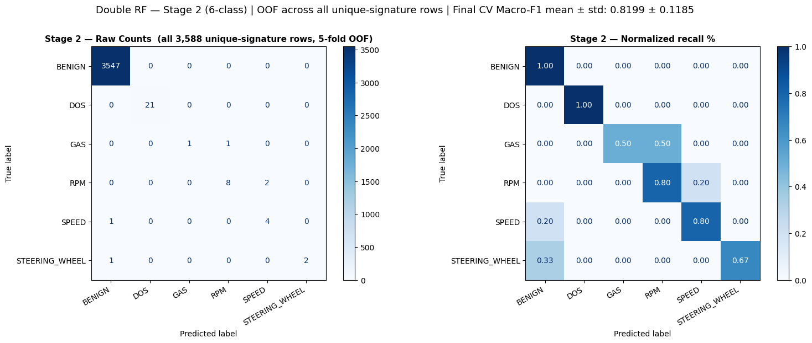
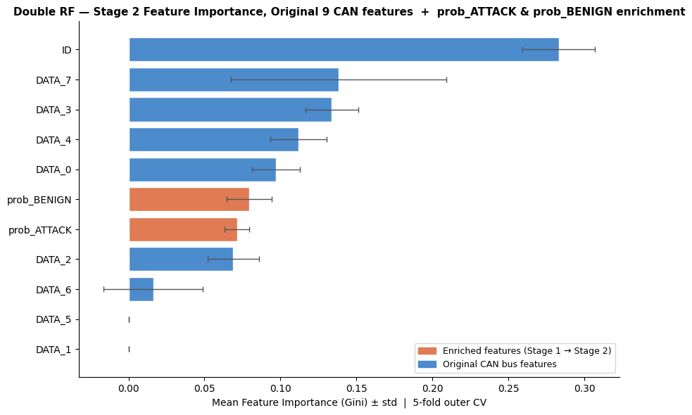
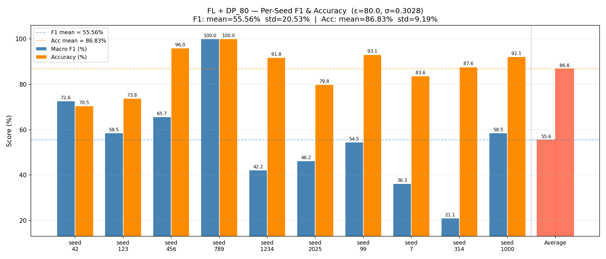
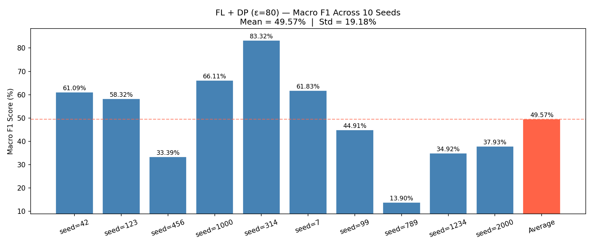

# IoV-secureFL-Pipeline
## Secure Federated Learning Pipeline for Unique-Signature Intrusion Detection in IoV Networks

## Overview

A production-ready machine learning pipeline featuring a novel **Federated Double Random Forest (Double RF)** architecture. This project implements a comprehensive security analysis pipeline for Internet of Vehicles (IoV) networks. By leveraging a two-stage federated ensemble method, vehicles can collaboratively train highly accurate Intrusion Detection Systems (IDS) without ever centralizing sensitive Controller Area Network (CAN) bus logs.

| Phase | Description | Status |
|-------|-------------|--------|
| **Phase 1** | Centralized Baseline & Double RF Prototyping | Complete |





| **Phase 2** | Privacy-Preserving Federated Double Random Forest (NVFlare + XGBoost) | Complete |
|-------|-------------|--------|



| **Phase 3** | Real Distributed Deployment (AWS EC2 + S3, Non-IID) | Complete |
|-------|-------------|--------|



---

# Project Structure

```
IoV-secureFL-Pipeline/              ← Phase 1 & 2 (this repo)
├── data/
│   ├── raw/                         # Original CICIoV2024 CSVs per class
│   └── processed/                   # Deduplicated + federated splits
├── jobs/
│   └── random_forest_base/          # NVFlare job template (executor + config)
├── notebooks/
│   └── 01_reproducing_exploration_baseline.ipynb
├── utils/
│   ├── model_validation.py          # Evaluate global model on held-out test set
│   ├── generate_dp_report.py        # DP sweep runner (multi-seed, saves CSV)
│   ├── dpReport_visualization.py    # Plot F1 vs ε and F1 vs σ tradeoff curves
│   └── prepare_job_config.py
├── DP_SEED_report/                  # DP sweep CSVs and plots
│   ├── dp_tradeoff_C1.1_v3.csv      # Main Phase 2 sweep (C=1.1, 10 seeds, all ε)
│   ├── dp_tradeoff_C1.1_v3.png      # Tradeoff plot (F1 vs ε, F1 vs σ)
│   ├── phase1_heldout_sweep.csv     # Phase 1 held-out 80/20 results (10 seeds)
│   └── seeds_comparing_v3.png       # Per-seed F1 comparison chart
├── reports/
│   ├── phase1_seed_sweep.csv        # Phase 1 nested CV results (10 seeds)
│   └── phase1_seed_sweep.png
├── utils/clippingValues.py           # Diagnostic: inspect XGBoost leaf value distribution
├── jobs_gen.sh                      # Generate NVFlare job configs
├── run_experiment_simulator.sh      # Launch NVFlare simulator
└── cleansing_job.sh                 # Remove generated artifacts

IoV-secureFL-Pipeline_awsEC2/     ← Phase 3 (separate deployment folder)
├── fleet_deployment.sh              # Bootstrap + rsync all 5 EC2 client nodes
├── network_provision.sh             # NVFlare provisioning + cert distribution
├── jobs_gen.sh                      # Generate + deploy job config (with DP_EPSILON)
├── start_fleet.sh                   # Start NVFlare clients on all 5 EC2 nodes
├── monitor_fleet.sh                 # Monitor client training output
├── evaluate.sh                      # Extract models + run evaluation
└── README.md                        # Full step-by-step AWS deployment guide
```

---

# Phase 1 — Centralized Baseline & Double RF Prototyping

Establishes a performance baseline using centralized machine learning to validate the Double RF architecture before transitioning to a federated environment.

## Architecture

Two-stage sequential **Expert-Master** model:
- **Stage 1 (Binary Expert):** Binary classifier — detects attack vs benign
- **Stage 2 (Multi-class Master):** 6-class classifier augmented with `prob_ATTACK` from Stage 1

## Setup

**Requirements:** Python 3.12+, [uv](https://docs.astral.sh/uv/)

```bash
# Install uv (Linux / macOS)
curl -LsSf https://astral.sh/uv/install.sh | sh
source ~/.bashrc

# Create virtual environment and install dependencies
uv venv --python 3.12
source .venv/bin/activate
uv sync
```

**Patch NVFlare** (removes unused torch/tensorboard imports that slow down installation):
```bash
python utils/patch_nvflare.py
```

## Dataset

Place the raw dataset at:
```
./data/CICIoV2024.csv
```

## Run

```bash
jupyter notebook notebooks/01_reproducing_exploration_baseline.ipynb
```

Follow the notebook cells:
1. Load & Clean — preprocess CAN bus sensor data
2. Train Stage 1 — binary expert → generates `prob_ATTACK` feature
3. Train Stage 2 — 6-class master on augmented feature set
4. Evaluate — confusion matrix, classification report (baseline F1, Accuracy, LogLoss)
5. **Phase 1 Held-Out 80/20** — centralized Double RF evaluated on a fixed 20% held-out test set (same protocol as Phase 2, bridges cross-phase comparison)

## Results Summary

| Evaluation Protocol | Mean F1 | Std | Notes |
|---|---|---|---|
| Phase 1 — Nested 5×5 CV | **79.97%** | ±4.57% | Seeds: 42,123,456,789,1000,**7**,9,342,691,2000 |
| Phase 1 — Held-Out 80/20 | **70.97%** | ±17.66% | Seeds: 42,123,456,789,1000,**1542**,9,342,691,2000 |

The ~9 pp gap between the two Phase 1 results is purely the **evaluation protocol cost** — not a model quality difference. The held-out version bridges cleanly to Phase 2's federated results.

---

# Phase 2 — Privacy-Preserving Federated Double Random Forest

Distributes the Double RF across 5 simulated vehicle sites using **NVIDIA FLARE**. Raw CAN bus data never leaves each vehicle — only XGBoost tree structures are communicated to the server.

## Architecture

- **Orchestration:** NVFlare Simulator (5 virtual client sites)
- **Aggregation:** Custom `XGBMultiClassBaggingAggregator` — fixes two upstream NVFlare bugs (stage contamination + `num_class` blindness)
- **Rounds:** 2 communication rounds (Stage 1 binary → Stage 2 6-class)
- **Privacy:** Local data stays isolated; server only sees aggregated tree weights

## Step 1 — Data Partitioning

Splits the deduplicated dataset into 5 stratified site partitions (IID):

```bash
bash data_split_gen.sh ./data
```

Output: `data/IoV/data_splits/data_site-{1..5}.json`

---

## Experiment A — Without Differential Privacy

Trains the Federated Double RF with no noise added to leaf values.

### Step 2 — Generate Job Config

```bash
bash jobs_gen.sh ./data
```

### Step 3 — Run Simulator

```bash
bash run_experiment_simulator.sh
```

### Step 4 — Validate Global Model

```bash
python utils/model_validation.py
```

Output: macro F1, accuracy, per-class breakdown against the holdout test set.

---

## Experiment B — With Differential Privacy (ε, δ)-DP

Adds calibrated Gaussian noise to XGBoost leaf values after local training.

**Mechanism:** `σ = C · √(2 ln(1.25/δ)) / ε`

**Clipping bound:** `C = 1.1` — empirically verified from the actual XGBoost leaf value distribution.
Both Stage 1 (binary) and Stage 2 (6-class) leaf values fall within **[-1.01, 1.01]** across all runs.
C=1.1 covers 100% of observed leaf values with a ~9% safety margin. Using a larger C (e.g., the original C=5.0) inflates σ proportionally and adds unnecessary noise without improving privacy.

```bash
# Inspect leaf value distribution to verify C (optional)
python utils/clippingValues.py
```

### Option B.1 — Single Run (one ε, one seed)

```bash
DP_CLIP_BOUND=1.1 DP_EPSILON=20 SEED=42 bash jobs_gen.sh ./data
bash run_experiment_simulator.sh
python utils/model_validation.py
```

### Option B.2 — Full DP Sweep (multi-ε, multi-seed, saves CSV report)

Runs each ε value across 10 seeds. Computes mean ± std for F1 and Accuracy.

**Seeds:** `42, 123, 456, 789, 1000, 1542, 9, 342, 691, 2000`

**Expected runtime: ~25 minutes**

```bash
DP_CLIP_BOUND=1.1 python utils/generate_dp_report.py \
  --epsilon "inf; 80; 50; 20; 18; 16; 15; 13; 10; 5" \
  --seeds "42, 123, 456, 789, 1000, 1542, 9, 342, 691, 2000" \
  --csv_out DP_SEED_report/dp_tradeoff_C1.1_v3.csv
```

**DP tradeoff results (C=1.1, 10 seeds, `dp_tradeoff_C1.1_v3.csv`):**

| ε | σ | Mean F1 | Std | Region |
|---|---|---|---|---|
| ∞ | 0.000 | 68.74% | ±13.75% | No-DP baseline |
| 80 | 0.067 | 68.34% | ±14.55% | Near-lossless |
| 50 | 0.107 | 65.29% | ±15.90% | Near-lossless |
| 20 | 0.267 | 61.33% | ±13.20% | Degraded — **Phase 3 operating point** |
| 18 | 0.296 | 60.85% | ±13.42% | Degraded |
| 16 | 0.333 | 58.60% | ±16.30% | Degraded |
| 15 | 0.355 | 54.98% | ±16.21% | Degraded |
| 13 | 0.410 | 50.94% | ±19.46% | Pre-collapse |
| 10 | 0.533 | 40.34% | ±19.17% | Collapse begins |
| 5 | 1.066 | 28.37% | ±16.66% | Collapse |

**ε=20 selected as the Phase 3 operating point:** last value in the stable degradation zone (~7.4 pp F1 cost vs no-DP baseline), providing moderate-to-strong privacy. Collapse begins sharply between ε=15 and ε=13.

### Option B.3 — Visualize DP Tradeoff

```bash
python utils/dpReport_visualization.py \
  --csv DP_SEED_report/dp_tradeoff_C1.1_v3.csv \
  --out DP_SEED_report/dp_tradeoff_C1.1_v3.png
```

Generates: F1 & Accuracy vs ε (log scale) and F1 vs σ, with per-point labels on the x-axis.

---

## Cross-Phase Performance Summary

| Setting | Mean F1 | Std | Cumulative Cost |
|---|---|---|---|
| Phase 1 — Nested CV | 79.97% | ±4.57% | — |
| Phase 1 — Held-Out 80/20 | 70.97% | ±17.66% | −9.00 pp (protocol) |
| Phase 2 — Federated, no-DP | 68.74% | ±13.75% | −2.23 pp (FL + framework) |
| Phase 2 — Federated, ε=20 | 61.33% | ±13.20% | −7.41 pp (DP noise) |
| Phase 3 — Real EC2, Non-IID, ε=20 | TBD | — | Non-IID penalty |

---

## Cleanup

Remove all generated artifacts (workspace, job configs, reports):

```bash
bash cleansing_job.sh           # dry run — shows what would be deleted
bash cleansing_job.sh --confirm # actually delete
```

---

# Phase 3 — AWS EC2 + S3 (Real Distributed Deployment)

> Full step-by-step guide: [`IoV-secureFL-Pipeline_awsEC2/README.md`](../IoV-secureFL-Pipeline_awsEC2/README.md)

Deploys the same Double RF pipeline on real distributed AWS EC2 infrastructure with **Non-IID data splitting** (Dirichlet distribution) to simulate realistic vehicle fleet heterogeneity.

## Key Differences from Phase 2

| | Phase 2 | Phase 3 |
|---|---|---|
| Infrastructure | NVFlare simulator, single machine | 6 EC2 instances (1 master server + 5 vehicle clients) |
| Data split | IID stratified (StratifiedKFold) | Non-IID Dirichlet (BENIGN α=2.0, attack α=0.5) |
| Data location | Local CSV | Local CSV on each EC2 node (rsync'd from master) |
| DP epsilon | Sweep (1 → ∞) | Fixed ε=20 |
| Clipping bound C | 1.1 | 1.1 |

## Infrastructure

- **Master server**: `172.31.33.187` — runs FL server + admin console (ports 8002, 8003)
- **Vehicle clients (site-1 to site-5)**: `172.31.71.9`, `172.31.67.199`, `172.31.76.174`, `172.31.77.237`, `172.31.64.105`
- **SSH key**: `ec2Key/iov-dp-key.pem`
- **OS**: Ubuntu 22.04 LTS, Python 3.12 via `uv`

## Non-IID Split Design

Uses **class-specific Dirichlet concentration**:
- **BENIGN (α=15.0)** — majority class (~96% of data); near-uniform distribution keeps normal traffic stable so heterogeneity is isolated to attack classes only
- **Attack classes (α=0.5)** — heterogeneous by design; some sites intentionally receive zero samples of certain attack types, forcing the federation to learn globally what no single vehicle knows locally

## Quick Execution Reference

```bash
cd ~/IoV-secureFL-Pipeline_awsEC2

# 1. Clean master + clients
./cleansing_job.sh --confirm && ./clean_fleet.sh

# 2. Install deps + deploy to all 5 clients
uv sync && source .venv/bin/activate
./fleet_deployment.sh

# 3. Generate data splits (non-IID Dirichlet)
bash data_split_gen.sh ./data

# 4. Provision NVFlare network (certs + startup kits)
bash network_provision.sh

# 5. Generate job config with DP ε=20, C=1.1
DP_EPSILON=20 DP_CLIP_BOUND=1.1 SEED=42 bash jobs_gen.sh ./data

# 6. Start server, then all clients
bash workspace/iov_securefl_network/prod_00/server/startup/start.sh
./start_fleet.sh

# 7. Submit job via admin console
bash workspace/iov_securefl_network/prod_00/admin@master.com/startup/fl_admin.sh
# Inside console: submit_job iov_double_rf_5_sites

# 8. Evaluate
./evaluate.sh
```

See [`IoV-secureFL-Pipeline_awsEC2/README.md`](../IoV-secureFL-Pipeline_awsEC2/README.md) for full details including monitoring, troubleshooting, and model architecture.

---

# Related Publication

This project extends the following peer-reviewed paper, which established the centralized baseline (Phase 1) and the unique-signature deduplication methodology used throughout all phases:

**Hop Le & Izzat Alsmadi** (2026). *Intrusion Detection for Internet of Vehicles CAN Bus Communications Using Machine Learning: An Empirical Study on the CICIoV2024 Dataset.* **Future Internet**, 18(1), 42. [https://doi.org/10.3390/fi18010042](https://doi.org/10.3390/fi18010042)

**Key findings from the paper:**
- Strict deduplication of CAN frames exposes data leakage in previously reported "near-perfect" detection rates
- Random Forest with Stratified K-Fold cross-validation provides the most reliable centralized baseline
- Lightweight models outperform deep learning on realistic, non-redundant IoV data

This federated pipeline (Phases 2–3) builds directly on those findings — distributing the Random Forest across 5 vehicle nodes with Differential Privacy to achieve privacy-preserving collaborative IDS without centralizing raw CAN bus data.
